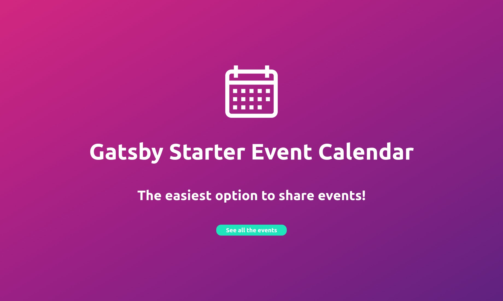

# Gatsby Starter: Event Calendar for Flotiq 📅



## Features 🛠

- [Gatsby](https://www.gatsbyjs.org/)
- [Grommet](http://grommet.io): A react-based framework that provides accessibility, modularity, responsiveness, and Theming in a tidy package
- Dynamic content from [Flotiq events](https://flotiq.com/)
- Offline support
- A11y support: content and navigation ready for screen readers.
- PWA ready
- SEO
- Responsive design
- Icons from [grommet-icons](https://github.com/grommet/grommet-icons)
- [Heroku](https://www.heroku.com) Deployment Friendly
- Developer tools:
  - eslint
  - prettier

## How to start ▶️

If you never used Gatsby before, I highly recommend you to [set up your development environment](https://www.gatsbyjs.org/tutorial/part-zero/)!

To copy and install this starter run this command:

```bash
$ gatsby new event-calendar https://github.com/flotiq/gatsby-starter-event-calendar
```

The main data source of this starter is a Event Content Type in [Flotiq.com](https://flotiq.com), after you [register](https://editor.flotiq.com/register.html), you can choose Event when you create your first Content Type Definition (all you need to do is follow the tutorial on Flotiq Dashboard).

The last step is to configure our application to know from where it has to fetch the data, this is going to be made by using `environment variables`. You need to create a file called `.env` inside the root of the directory, with the following structure:

```js
GATSBY_FLOTIQ_BASE_URL=https://api.flotiq.com
FLOTIQ_API_KEY=YOUR API KEY
```

To get YOUR API KEY check out [documentation](https://flotiq.com/docs/API/).

 If you wish to import example events to your account, before running `gatsby develop` run:
        
```sh
node ./example/importExample.js
```

It will add 5 events to your Flotiq account.

_Note: You need to put your Read and write API key in `.env` for import to work. You don't need Event content type in your account. If you already have events with ids `event-1`, `event-2`, `event-3`, `event-4`, and `event-5` they will be overwritten._

After this you can start development:
```
gatsby develop
```

## App Configuration

Inside the root folder, there is a file called `appConfig.js`, which allow you to customize the starter with your own preferences. It has the following structure:

```json
{
  "title": "Gatsby Starter Event Calendar",
  "subTitle": "The easiest option to share events!",
  "maxAmountEvents": 2,
  "limitMonthInTheFuture": 2,
  "theme": {}
}
```

All these values can be changed by the developer and in case one of them it's not defined they all have default values. Inside the application, these values are being accessed using the component called `ConfigContext` which is a basic implementation of `React Context`.

### Theming

`Grommet` has a prop called theme when the developer can set all the colors that are going to be used inside the application. Therefore there are some `standard` colors, like `background` and `text`, but there is a whole object just to configure how the `Calendar` is going to look like.

You can change any of the existing themes or create your own following this structure:

```json
{
  "background": "white",
  "brand": "pink",
  "secondary": "violet",
  "focus": "pink",
  "text": "black",

  "calendar": {
    "today": {
      "background": "pink",
      "text": "violet",
      "border": "grey"
    },
    "day": {
      "background": "white",
      "text": "black",
      "border": "grey"
    },
    "past": {
      "background": "lightgrey",
      "text": "black",
      "border": "grey"
    },
    "empty": {
      "background": "lightblue",
      "border": "grey"
    },
    "weekdays": {
      "background": "white",
      "text": "black",
      "border": "grey"
    },
    "event": {
      "background": "white",
      "text": "black"
    },
    "modal": {
      "text": "black",
      "background": "white"
    }
  }
}
```

Inside the folder [themes](./themes) you can find a few examples I made to show how versatile is the theming in this application. Here are some screenshots:

#### Main


#### Base


### Dark


### Transparent


## Project structure 🏗

Event calendar starter is an SPA (Single Page Application), so basically it has only two pages:

- Index.js (the page itself)
- 404.js (nice 404 error page that match the style)

The structure for the main page is the following:

```javascript
<PageLayout>
  <Hero />
  <Calendar>
    <Month />
    <Month />
  </Calendar>
  <ModalEvent />
</PageLayout>
```

`PageLayout` is the main of the application, it creates the `ConfigContext` where we have access to all the information inside `appConfig.js` and renders `Grommet` wrapper with the theme of the application.

`Hero` display almost all the information define in `appConfig`, like title, subtitle and a `Button` that redirect to the `formLink` so people can add a new event from the page.

`Calendar` is in charge of executing the query to get the events, then group them by month and render a `Month` component with the grouped events. The amount of rendered `Month` can be changed inside `appConfig.js`.

`ModalEvent` is the popup that is going to be shown when someone clicks on a day with events, and it renders the information of all the events for that day.

## License 📝

MIT.

<div>Icons made by <a href="https://www.freepik.com/" title="Freepik">Freepik</a> from <a href="https://www.flaticon.com/"                 title="Flaticon">www.flaticon.com</a> is licensed by <a href="http://creativecommons.org/licenses/by/3.0/"                 title="Creative Commons BY 3.0" target="_blank">CC 3.0 BY</a></div>


## 🎓 Learning Gatsby

Looking for more guidance? Full documentation for Gatsby lives [on the website](https://www.gatsbyjs.org/). Here are some places to start:

- **For most developers, we recommend starting with our [in-depth tutorial for creating a site with Gatsby](https://www.gatsbyjs.org/tutorial/).** It starts with zero assumptions about your level of ability and walks through every step of the process.

- **To dive straight into code samples, head [to our documentation](https://www.gatsbyjs.org/docs/).** In particular, check out the _Guides_, _API Reference_, and _Advanced Tutorials_ sections in the sidebar.

## 🎓 Learning Flotiq

If you're new to Flotiq, head over to [Flotiq Docs](https://flotiq.com/docs) to learn all about it and [Register your free Flotiq account](https://editor.flotiq.com/register.html).

## 💫 Deploy

[](https://heroku.com/deploy?template=https://github.com/flotiq/gatsby-starter-event-calendar)

