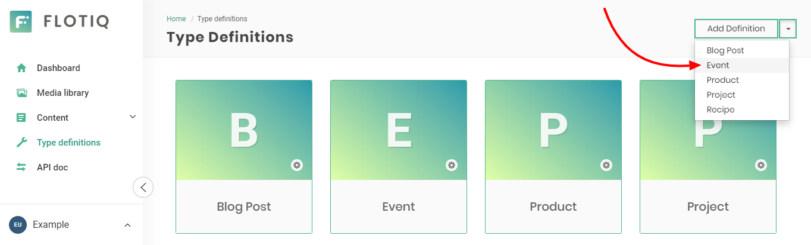
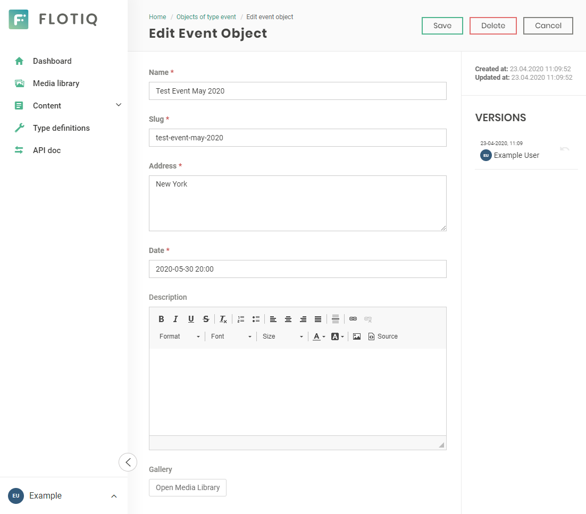
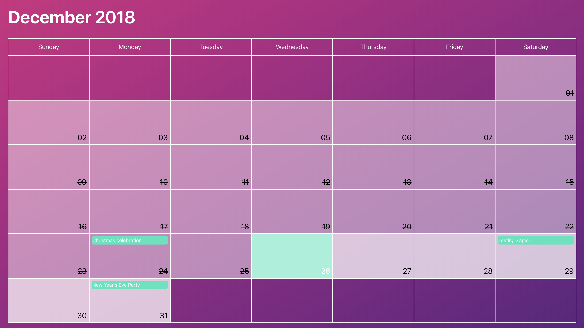
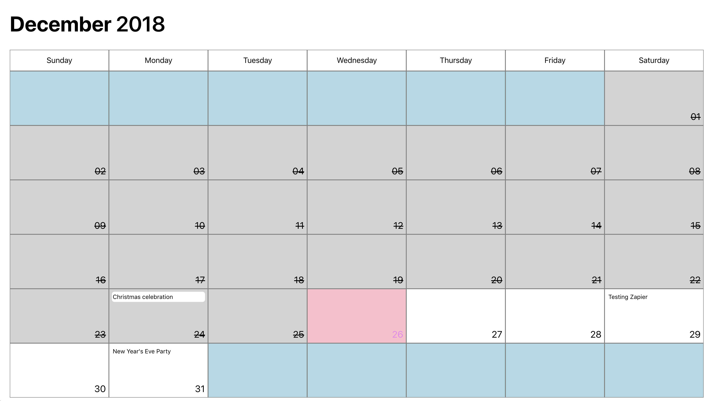
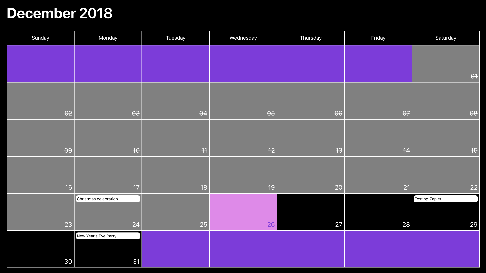
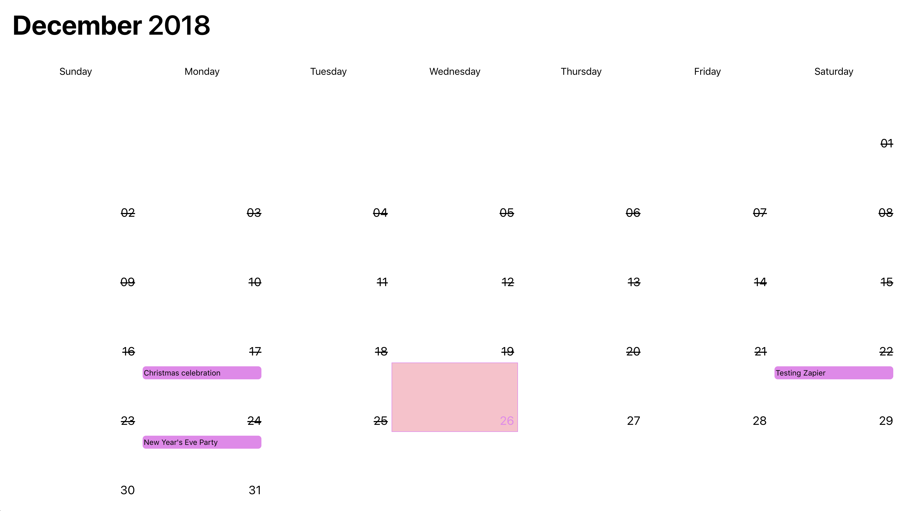

<a href="https://flotiq.com/">
    
</a>

Gatsby Starter - Event Calendar
========================

This is a [Gatsby](https://gatsbyjs.org) starter project for a event calendar. It's configured to pull events data from [Flotiq](https://flotiq.com) and can be easily deployed to your cloud hosting - Heroku, Netlify, Gatsby Cloud, etc.

Live Demo: https://flotiq-starter-for-events-cal.herokuapp.com/

Screenshot


## Quick start

1. **Start project from template using Gatsby CLI**
    
    ```bash
    gatsby new event-calendar https://github.com/flotiq/gatsby-starter-event-calendar
    ```
   
1. **Setup "Event" Content Type in Flotiq**

   Create your [Flotiq.com](https://flotiq.com) account. Next, create the `Event` Content Type:

   
    
   _Note: You can also create `Event` using [Flotiq REST API](https://flotiq.com/docs/API/)._ 

1. **Configure application**

    The next step is to configure our application to know from where it has to fetch the data.
       
    You need to create a file called `.env` inside the root of the directory, with the following structure:

    ```
    GATSBY_FLOTIQ_BASE_URL=https://api.flotiq.com
    FLOTIQ_API_KEY=YOUR FLOTIQ API KEY
    ```

1.  **Start developing**

    Navigate into your new site’s directory and start it up.

    ```sh
    cd event-calendar/
    npm install
    gatsby develop
    ```
    
    If you wish to import example events to your account, before running `gatsby develop` run:
            
    ```sh
    node ./example/importExample.js
    ```
    
    It will add 5 events to your Flotiq account.
    
    _Note: You need to put your Read and write API key in `.env` for import to work. You don't need Event content type in your account. If you already have events with ids `event-1`, `event-2`, `event-3`, `event-4`, and `event-5` they will be overwritten._
   
1.  **Open the source code and start editing!**
    
    Your site is now running at [http://localhost:8000](http://localhost:8000)!
    
    _Note: You'll also see a second link: _[http://localhost:8000/___graphql](http://localhost:8000/___graphql)`_. This is a tool you can use to experiment with querying your data. Learn more about using this tool in the [Gatsby tutorial](https://www.gatsbyjs.org/tutorial/part-five/#introducing-graphiql)._
    
    Open a project directory in your code editor of choice and edit `src/templates/index.js`. Save your changes and the browser will update in real time!

1. **Manage your posts using Flotiq editor**
      
    You can now easily manage your posts using [Flotiq editor](https://editor.flotiq.com)
    
    

## App Configuration

Inside the root folder, there is a file called `appConfig.js`, which allow you to customize the starter with your own preferences. It has the following structure:

```json
{
  "title": "Gatsby Starter Event Calendar",
  "subTitle": "The easiest option to share events!",
  "maxAmountEvents": 2,
  "limitMonthInTheFuture": 2,
  "theme": {}
}
```

All these values can be changed by the developer and in case one of them it's not defined they all have default values. Inside the application, these values are being accessed using the component called `ConfigContext` which is a basic implementation of `React Context`.

### Theming

`Grommet` has a prop called theme when the developer can set all the colors that are going to be used inside the application. Therefore there are some `standard` colors, like `background` and `text`, but there is a whole object just to configure how the `Calendar` is going to look like.

You can change any of the existing themes or create your own following this structure:

```json
{
  "background": "white",
  "brand": "pink",
  "secondary": "violet",
  "focus": "pink",
  "text": "black",

  "calendar": {
    "today": {
      "background": "pink",
      "text": "violet",
      "border": "grey"
    },
    "day": {
      "background": "white",
      "text": "black",
      "border": "grey"
    },
    "past": {
      "background": "lightgrey",
      "text": "black",
      "border": "grey"
    },
    "empty": {
      "background": "lightblue",
      "border": "grey"
    },
    "weekdays": {
      "background": "white",
      "text": "black",
      "border": "grey"
    },
    "event": {
      "background": "white",
      "text": "black"
    },
    "modal": {
      "text": "black",
      "background": "white"
    }
  }
}
```

Inside the folder [themes](./themes) you can find a few examples I made to show how versatile is the theming in this application. Here are some screenshots:

#### Main



#### Base



### Dark



### Transparent



## Deploy

  You can deploy this project to Heroku in 3 minutes:

  [](https://heroku.com/deploy?template=https://github.com/flotiq/gatsby-starter-event-calendarg)
  
  Or to Netlify:
  
  [](https://app.netlify.com/start/deploy?repository=https://github.com/flotiq/gatsby-starter-event-calendar)


## Collaborating

   If you wish to to talk with us about this project, feel free to hop on our [discord server](https://discord.gg/FwXcHnX).
   
   If you found a bug, please report it in [issues](https://github.com/flotiq/gatsby-starter-event-calendar/issues).
